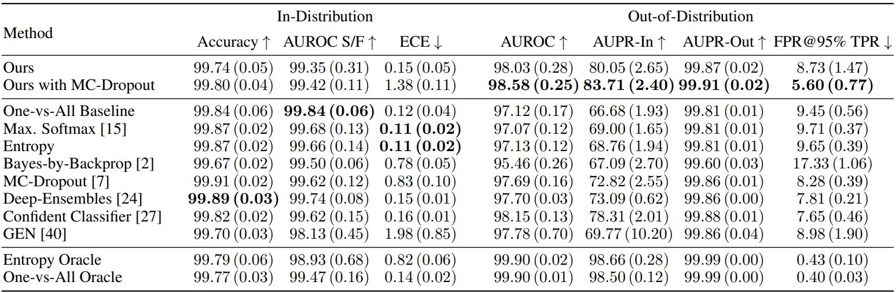
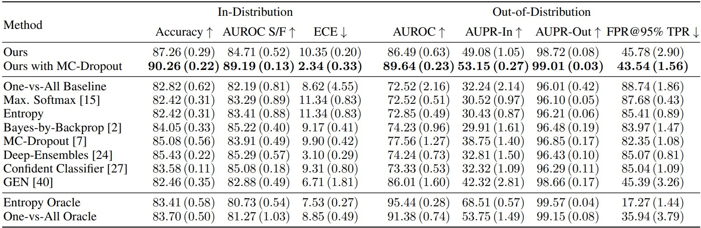
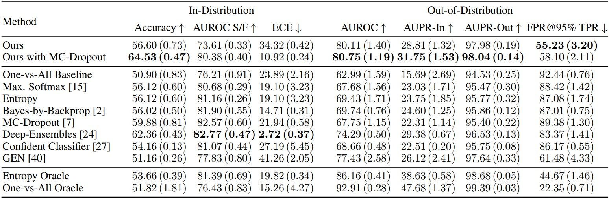
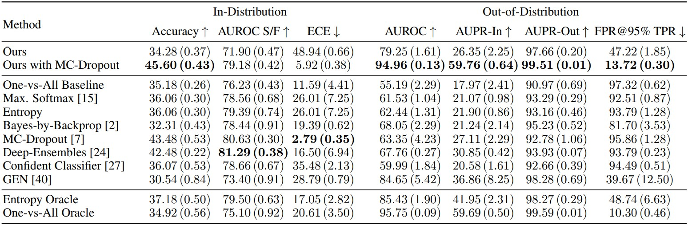

<div align="center">

[](https://github.com/RonMcKay/UQGAN/blob/main/LICENSE)  [](https://github.com/psf/black) [](mailto:git@oberdiek.net) [](https://arxiv.org/abs/2201.13279)


</div>

<div align="center">

# UQGAN: A Unified Model for Uncertainty Quantification of Deep Classifiers trained via Conditional GANs  
**Philipp Oberdiek** (TU Dortmund University), **Gernot Fink** (TU Dortmund University),  
**Matthias Rottmann** (EPFL, University of Wuppertal)

</div>

This repository supplies the code for training an UQGAN als well as all reference implementations of related works mentioned in the paper.

# Table of Contents
- [Installation](#installation)
- [Training](#training)
- [Evaluation](#evaluation)
- [Pre-trained Models](#pre-trained-models)
- [Results](#results)
  - [MNIST](#mnist)
  - [CIFAR10](#cifar10)
  - [CIFAR100](#cifar100)
  - [Tiny ImageNet](#tiny-imagenet)
- [Useful Information](#useful-information)
  - [Adding your own model](#adding-your-own-model)
  - [Adding your own dataset](#adding-your-own-dataset)
- [Citing](#citing)

# Installation

This repository was tested with **python 3.7**.

1. Clone the repository and change directory
   ```
   git clone https://github.com/RonMcKay/UQGAN
   cd UQGAN
   ```
2. (optional) Create and source virtual environment
   ```
   python3 -m venv .venv
   source .venv/bin/activate
   ```
3. Install dependencies
   ```
   pip install -r requirements.txt
   ```
4. Configure paths to datasets and an experiment folder in [`config.py`](./config.py)

# Training

- UQGAN  
  1. Train conditional Auto-Encoder  
     ```
     python3 train_cae.py with configs/cae_uqgan/<dataset name>.yml
     ```
  2. Train UQGAN  
     ```
     python3 train_uqgan.py with configs/uqgan/<dataset name>.yml cae_model.cfg.checkpoint=<path to previous model checkpoint>
     ```
- UQGAN with MC-Dropout
  1. Train conditional Auto-Encoder  
     ```
     python3 train_cae.py with configs/cae_uqgan/<dataset name>.yml
     ```
  2. Train UQGAN  
     ```
     python3 train_uqgan.py with configs/uqgan-mc/<dataset name>.yml cae_model.cfg.checkpoint=<path to previous model checkpoint>
     ```
- One-vs-All Baseline  
  ```
  python3 train_classifier.py with configs/ova/<dataset name>.yml
  ```
- Max. Softmax  
  ```
  python3 train_classifier.py with configs/softmax/<dataset name>.yml
  ```
- Entropy  
  see 'Max. Softmax'
- Bayes-by-Backprop  
  ```
  python3 train_classifier.py with configs/bayes/<dataset name>.yml
  ```
- MC-Dropout  
  ```
  python3 train_classifier.py with configs/mc_dropout/<dataset name>.yml
  ```
- Deep-Ensembles  
  see 'Max. Softmax' times your desired ensemble size
- Confident Classifier  
  ```
  python3 train_confident_classifier.py with configs/confident_classifier/<dataset name>.yml
  ```
- GEN  
  ```
  python3 train_gen.py with configs/gen/<dataset name>.yml
  ```
- Entropy Oracle  
  ```
  python3 train_meta_classifier.py with configs/oracle-entropy/<dataset name>.yml
  ```
- One-vs-All Oracle  
  ```
  python3 train_meta_classifier.py with configs/oracle-ova/<dataset name>.yml
  ```

# Evaluation

If you specify multiple experiment ids the scripts will compute the standard deviation of the evaluation metrics over all runs.

- Deep Ensembles  
  ```
  python3 eval_ood_detection_deep_ensembles.py with dataset.cfg.mode=test dataset.cfg.static=True args.ood_datasets=<comma separated ood datasets> args.exp_ids=<range of experiment ids>
  ```
- Entropy  
  ```
  python3 eval_ood_detection.py with dataset.cfg.mode=test dataset.cfg.static=True args.ood_datasets=<comma separated ood datasets> args.exp_ids=<range of experiment ids> args.method_overwrite=entropy
  ```
- Everything else  
  ```
  python3 eval_ood_detection.py with dataset.cfg.mode=test dataset.cfg.static=True args.ood_datasets=<comma separated ood datasets> args.exp_ids=<range of experiment ids>
  ```

# Pre-trained Models

Under the following links you can find pre-trained models of the UQGAN with and without MC-Dropout on different datasets.

- UQGAN
  - MNIST 0-4  
  [Generator](https://zenodo.org/record/7135130/files/generator_mnist_0-4.ckpt?download=1) (3.2 MB)  
  [Discriminator](https://zenodo.org/record/7135130/files/discriminator_mnist_0-4.ckpt?download=1) (2.2 MB)  
  [Classifier](https://zenodo.org/record/7135130/files/classifier_mnist_0-4.ckpt?download=1) (250kB)  
  [conditional Auto-Encoder](https://zenodo.org/record/7135130/files/cae_mnist_0-4.ckpt?download=1) (4.2 MB)
  - CIFAR10 0-4  
  [Generator](https://zenodo.org/record/7135130/files/generator_cifar10_0-4.ckpt?download=1) (3.3 MB)  
  [Discriminator](https://zenodo.org/record/7135130/files/discriminator_cifar10_0-4.ckpt?download=1) (2.4 MB)  
  [Classifier](https://zenodo.org/record/7135130/files/classifier_cifar10_0-4.ckpt?download=1) (2.8 MB)  
  [conditional Auto-Encoder](https://zenodo.org/record/7135130/files/cae_cifar10_0-4.ckpt?download=1) (20.4 MB)
  - CIFAR100 0-49  
  [Generator](https://zenodo.org/record/7135130/files/generator_cifar100_0-49.ckpt?download=1) (3.5 MB)  
  [Discriminator](https://zenodo.org/record/7135130/files/discriminator_cifar100_0-49.ckpt?download=1) (2.5 MB)  
  [Classifier](https://zenodo.org/record/7135130/files/classifier_cifar100_0-49.ckpt?download=1) (3.2 MB)  
  [conditional Auto-Encoder](https://zenodo.org/record/7135130/files/cae_cifar100_0-49.ckpt?download=1) (21.7 MB)
  - Tiny ImageNet 0-99  
  [Generator](https://zenodo.org/record/7135130/files/generator_tinyimagenet_0-99.ckpt?download=1) (3.7 MB)  
  [Discriminator](https://zenodo.org/record/7135130/files/discriminator_tinyimagenet_0-99.ckpt?download=1) (2.6 MB)  
  [Classifier](https://zenodo.org/record/7135130/files/classifier_tinyimagenet_0-99.ckpt?download=1) (13.1 MB)  
  [conditional Auto-Encoder](https://zenodo.org/record/7135130/files/cae_tinyimagenet_0-99.ckpt?download=1) (74.7 MB)
- UQGAN with MC-Dropout
  - MNIST 0-4  
  [Generator](https://zenodo.org/record/7135130/files/generator_mnist_0-4_mc.ckpt?download=1) (3.2 MB)  
  [Discriminator](https://zenodo.org/record/7135130/files/discriminator_mnist_0-4_mc.ckpt?download=1) (2.2 MB)  
  [Classifier](https://zenodo.org/record/7135130/files/classifier_mnist_0-4_mc.ckpt?download=1) (250 kB)  
  [conditional Auto-Encoder](https://zenodo.org/record/7135130/files/cae_mnist_0-4.ckpt?download=1) (4.2 MB)
  - CIFAR10 0-4  
  [Generator](https://zenodo.org/record/7135130/files/generator_cifar10_0-4_mc.ckpt?download=1) (3.3 MB)  
  [Discriminator](https://zenodo.org/record/7135130/files/discriminator_cifar10_0-4_mc.ckpt?download=1) (2.4 MB)  
  [Classifier](https://zenodo.org/record/7135130/files/classifier_cifar10_0-4_mc.ckpt?download=1) (2.8 MB)  
  [conditional Auto-Encoder](https://zenodo.org/record/7135130/files/cae_cifar10_0-4.ckpt?download=1) (20.4 MB)
  - CIFAR100 0-49  
  [Generator](https://zenodo.org/record/7135130/files/generator_cifar100_0-49_mc.ckpt?download=1) (3.5 MB)  
  [Discriminator](https://zenodo.org/record/7135130/files/discriminator_cifar100_0-49_mc.ckpt?download=1) (2.5 MB)  
  [Classifier](https://zenodo.org/record/7135130/files/classifier_cifar100_0-49_mc.ckpt?download=1) (3.2 MB)  
  [conditional Auto-Encoder](https://zenodo.org/record/7135130/files/cae_cifar100_0-49.ckpt?download=1) (21.7 MB)
  - Tiny ImageNet 0-99  
  [Generator](https://zenodo.org/record/7135130/files/generator_tinyimagenet_0-99_mc.ckpt?download=1) (3.7 MB)  
  [Discriminator](https://zenodo.org/record/7135130/files/discriminator_tinyimagenet_0-99_mc.ckpt?download=1) (2.6 MB)  
  [Classifier](https://zenodo.org/record/7135130/files/classifier_tinyimagenet_0-99_mc.ckpt?download=1) (13.1 MB)  
  [conditional Auto-Encoder](https://zenodo.org/record/7135130/files/cae_tinyimagenet_0-99.ckpt?download=1) (74.7 MB)

# Results

## MNIST

In-Distribution dataset: MNIST 0-4  
Out-of-Distribution datasets: MNIST 5-9, EMNIST-Letters, Omniglot, Fashion-MNIST, SVHN, CIFAR10



## CIFAR10

In-Distribution dataset: CIFAR10 0-4  
Out-of-Distribution datasets: CIFAR10 5-9, LSUN, SVHN, Fashion-MNIST, MNIST



## CIFAR100

In-Distribution dataset: CIFAR100 0-49  
Out-of-Distribution datasets: CIFAR100 50-99, LSUN, SVHN, Fashion-MNIST, MNIST



## Tiny ImageNet

In-Distribution dataset: Tiny ImageNet 0-99  
Out-of-Distribution datasets: Tiny ImageNet 100-199, SVHN, Fashion-MNIST, MNIST



# Useful Information

- Most of the scripts you can find in this repository utilize sacred as experiment manager. You can alter the configuration of the scripts on the command line as e.g.
  ```
  python train_uqgan.py with args.iterations=1000 dataset.cfg.name=mnist+0-4
  ```
  If you just want to see the current config run `python train_uqgan.py print_config`. Run `python train_uqgan.py help` to see a list of available commands. Run `python train_uqgan.py options` to see a list of available hyperparameters with datatype and description.  
  You can find more on this on the [sacred documentation page](https://sacred.readthedocs.io/en/latest/index.html).
- You can define class-wise subsets of datasets with the following syntax
  ```
  dataset.cfg.name=<dataset_name>+<class_range>
  ```
  A `class_range` can be a list of classes as e.g. `0,3,5`, a range as `0-4` or a combination of both. Thus the following is a valid class subset: `mnist+0,3,6-8`.
- With the same syntax as for `class_range` you can also define a set of experiment ids for evaluation purposes (if you want to average results over multiple runs). Thus you can do something like
  ```
  python eval_ood_detection.py with args.exp_ids=3,5,16-18
  ```

## Adding your own model

If you want to add your own model you have to follow these steps:

1. Add your model definition files in `bnn_models`, `cae_models`, `cls_models`, `gan_models` and/or `vae_models`
2. Add another `if` condition in the respective `__init__.py` files in the `load_*_model` function. Choose a name for your model that does not already exist. You can have a look at the other model implementations for reference.

## Adding your own dataset

If you want to add your own dataset you have to follow these steps:

1. Add your dataloader class in `datasets`. It should accept the following options: `mode`, `transform`, `target_transform`. The `__getitem__` method should return a tuple consisting of the data and the class index. Please have a look at the other implementations for reference.
2. Add a default config for your dataset in `datasets/__init__.py:default_configs`. Please also have a look at the other configs here for reference.
3. Add another `if` condition in `load_data` in `datasets/__init__.py`. Choose a short name for your dataset that not already exists. You should define your dataloader as well as a sampler. If you do not want to subsample your dataset just set `sampler=None`.

# Citing

If you find this code useful and use it for your research, please cite the following

```txt
@inproceedings{OberdiekFR2022,
  author = {Oberdiek, Philipp and Fink, Gernot and Rottmann, Matthias},
  booktitle = {Advances in Neural Information Processing Systems},
  editor = {S. Koyejo and S. Mohamed and A. Agarwal and D. Belgrave and K. Cho and A. Oh},
  pages = {21371--21385},
  publisher = {Curran Associates, Inc.},
  title = {{UQGAN: A Unified Model for Uncertainty Quantification of Deep Classifiers trained via Conditional GANs}},
  url = {https://proceedings.neurips.cc/paper_files/paper/2022/file/8648e249887ccb0fe8c067d596e35b40-Paper-Conference.pdf},
  volume = {35},
  year = {2022},
}
```
